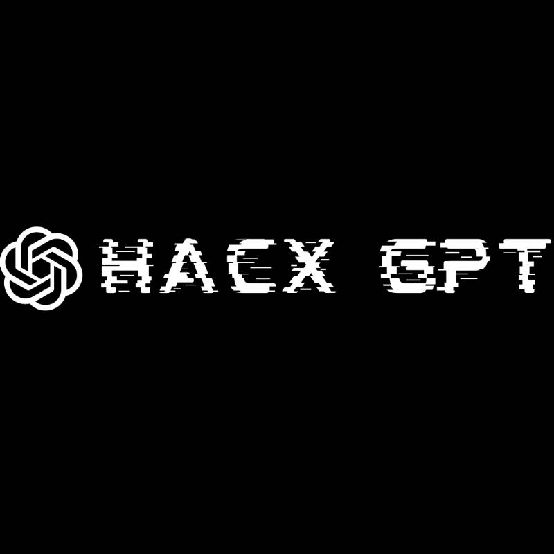
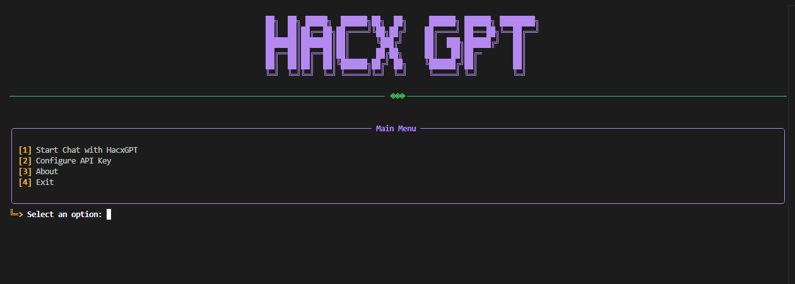

<div align="center">

  

  # HacxGPT

  <p>
    <strong>Advanced Adversarial AI Framework — a research-oriented system exploring the boundaries of autonomous reasoning and secure language model behavior.</strong>
  </p>

</div>

---

## 🧠 About The Project

**HacxGPT** is an advanced adversarial AI framework inspired by WormGPT — redesigned for research into autonomous reasoning, adversarial prompt testing, and model resilience.

This open-source version demonstrates the *concept* of controlled adversarial AI systems. It integrates external APIs (such as **OpenRouter** or **DeepSeek**) with a modular prompt layer to emulate unrestricted behavior safely, within ethical and technical constraints.

> **Note:** This repository contains a demonstration framework. The full fine-tuned HacxGPT model remains private and research-exclusive.

---

## ⚙️ Core Features

- **Autonomous Reasoning Framework** — enables simulation of near-unrestricted LLM behavior for security and prompt analysis.  
- **Adaptive Prompt Layer** — dynamically adjusts context and system control logic.  
- **Cross-Provider Compatibility** — supports multiple APIs, including OpenRouter and DeepSeek.  
- **Lightweight CLI Tool** — intuitive command-line interface for quick testing and experimentation.  
- **Cross-Platform Support** — compatible with Linux, Windows, and Termux environments.

---

## 🚀 Showcase

A look at the interactive CLI environment of **HacxGPT**.



---

## 🔐 Private Research Model

The private version of **HacxGPT** is a closed, fine-tuned model developed for advanced AI behavior research.

Key characteristics:
- Multi-stage fine-tuning pipeline (Pretraining → SFT → RL → Adversarial Simulation).  
- Optimized for context depth, reasoning precision, and adaptability.  
- Designed for responsible use in AI security and resilience research.

Access to the private model is restricted. For collaboration inquiries, contact the development team directly.

---

## ⚡ Installation

### Prerequisites
You will need an **API key** from a supported provider.

- [OpenRouter](https://openrouter.ai/keys)
- [DeepSeek](https://platform.deepseek.com/api_keys)

### Quick Install (Linux / Termux)
```bash
bash <(curl -s https://raw.githubusercontent.com/setls/HacxGPT/main/install.sh)
Manual Installation
bash
Copy code
git clone https://github.com/setls/HacxGPT.git
cd HacxGPT
pip install -r requirements.txt
python3 HacxGPT.py
🧩 Configuration
To switch providers, open the HacxGPT.py file and modify the following line:

python
Copy code
API_PROVIDER = "openrouter"  # or "deepseek"
⚠️ License
Distributed under the Personal-Use Only License (PUOL) 1.0.
See LICENSE.txt for details.

<div align="center"> <sub>© 2025 setls — All Rights Reserved</sub> </div> ```
